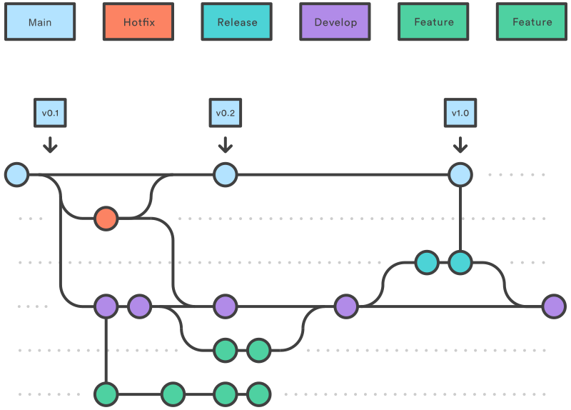

[//]: # (SPDX-FileCopyrightText: 2024-2025 Copyright Contributors to the MeteoForge project)

[//]: # (SPDX-License-Identifier: MPL-2.0)

# How to Contribute

We'd love to accept your patches and contributions to this project.
There are just a few small guidelines you need to follow.

## Filing bugs, change requests and questions

You can file bugs, change requests, and questions about the project via GitHub Issues.
Consult [GitHub Help](https://docs.github.com/en/free-pro-team@latest/github/managing-your-work-on-github/creating-an-issue)
for more information on using GitHub Issues.

## Community Guidelines

This project follows the following [Code of Conduct](./CODE_OF_CONDUCT.md).

## Source Code Headers

Every file containing source code must include copyright and license information.
This includes any JS/CSS files served to browsers.
(This is to help well-intentioned people avoid accidental copying that doesn't comply with the license.)

**Mozilla header:**

    SPDX-FileCopyrightText: 2019-2025 Alliander N.V.
    SPDX-License-Identifier: MPL-2.0

## Git branching

This project uses the [Gitflow Workflow](https://www.atlassian.com/git/tutorials/comparing-workflows/gitflow-workflow)
branching model.

- The `master` branch always contains the latest release.
- New feature branches are branched off from `develop`.
- Finished features are merged back into `develop`.
- At the end of a sprint, `develop` is merged into `master`, or optionally into a `release` branch before merging into
  `master`.

## Code reviews

All patches and contributions, including those by project members, require review by a maintainer.
We use GitHub pull requests for this.
Consult [GitHub Help](https://help.github.com/articles/about-pull-requests/) for more info.

## Pull Request Process

Contributions should be submitted as GitHub pull requests.
See [Creating a pull request](https://docs.github.com/en/github/collaborating-with-issues-and-pull-requests/creating-a-pull-request)
if you're unfamiliar with the process.

### Steps to follow

1. Create a topic branch in your local repository named like: `feature-[description]`.
   See the [Git branching guideline](#git-branching) for naming conventions.

2. Make changes, compile, and test thoroughly.
   Ensure all install/build dependencies are removed by the end of the build process.
   Follow existing code style and focus on the relevant topic.
   See the [style guide](#source-code-headers) for more details.

3. Push commits to your fork.

4. Create a GitHub pull request from your topic branch.

5. A maintainer will review your pull request.
   They may offer feedback, request changes, or approve the contribution.
   See the [code review guideline](#code-reviews) for expectations.

6. Once a maintainer signs off, you may merge your changes.
   If you don't have permission, a maintainer can merge it for you.

## Attribution

This `CONTRIBUTING.md` is adapted
from [Google’s contributing guide](https://github.com/google/new-project/blob/master/docs/contributing.rst).
